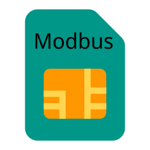
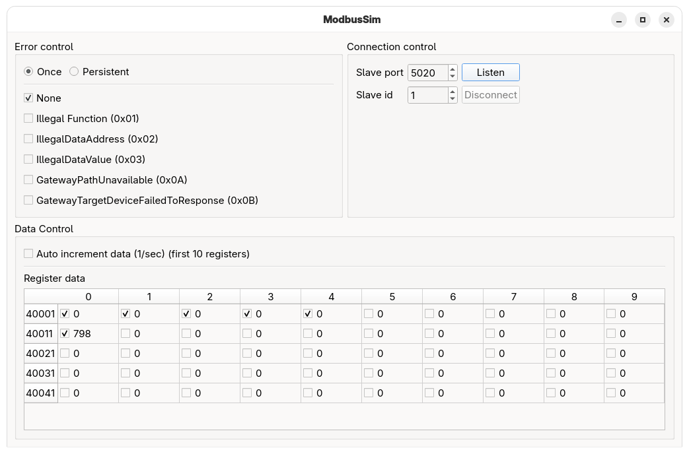

Build status: 

# What is ModbusSim
ModbusSim is a Modbus slave test application for validating Modbus master implementations.

Key features:

- Implements multiple configurable holding registers (values can be automatically incremented).
- Generates a sine-wave signal as register values.
- Can inject configurable communication errors to exercise master error handling.

